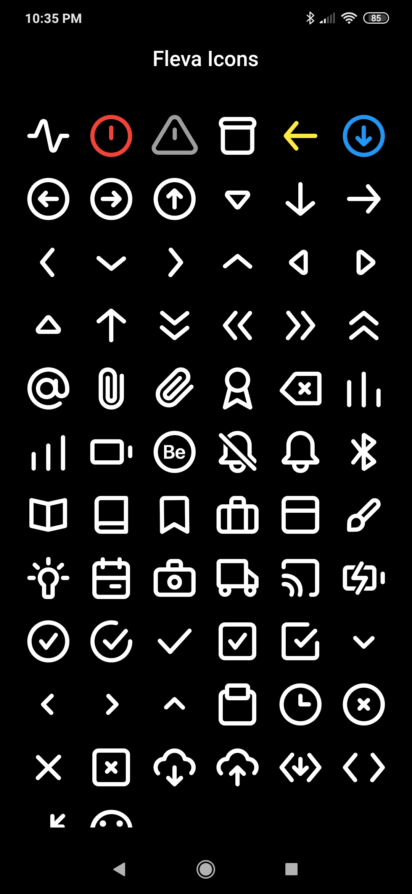

# fleva_icons

A best Eva Icons package for Flutter.

## About
Flutter package for [Eva Icons](https://akveo.github.io/eva-icons/). Eva Icons is a pack of more than 480 beautifully crafted Open Source icons for common actions and items.

This package brings [Eva Icons](https://akveo.github.io/eva-icons/) pack available as Flutter Icons. It has beautiful outlined and rounded Icons.


## Getting Started

In the dependencies: section of your `pubspec.yaml`, add the following line:

```yaml
fleva_icons: <latest_version>
```

## Usage

```dart
import 'package:fleva_icons/fleva_icons.dart';

class MyWidget extends StatelessWidget {
  Widget build(BuildContext context) {
    return IconButton(
      // Use the FlevaIcons class for the IconData
      icon: Icon(FlevaIcons.activity_outline),
      onPressed: () { print("Fleva Icons Pressed"); }
     );
  }
}
```


## Demo


